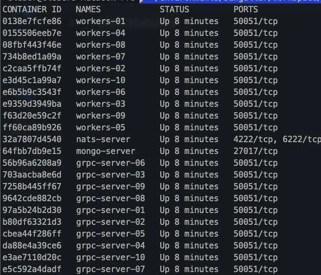
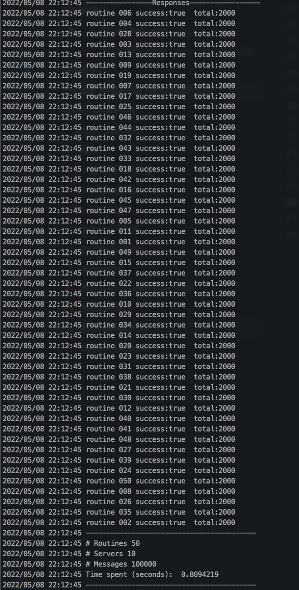
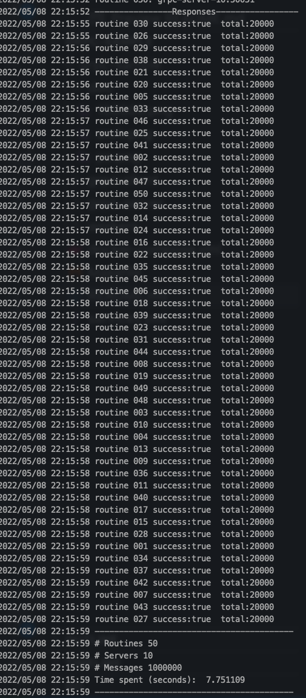
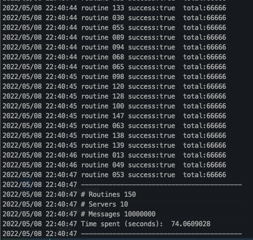

# grpc-sample

### High performance distributed architecture to ingest massive amounts of data using GRPC, Nats and Mongodb


## J4F

The J4F (Just for fun) projects are elaborate to demonstrate concepts, show benchmarks, and provoke doubts about well-established certainties

#

## Run Server

```sh
docker-compose up -d
```




## Run client

```sh
make client
```

## Samples
```sh
grpc-client --messages 100000 --concurrency 50 --servers 10
```

Sending 100k messages under 1 second using 50 routines



```sh
grpc-client --messages 1000000 --concurrency 50 --servers 10
```
Sending 1M messages under 8 seconds using 50 routines



```sh
grpc-client --messages 10000000 --concurrency 50 --servers 10
```
Sending 10M messages under 75 seconds using 100 routines

