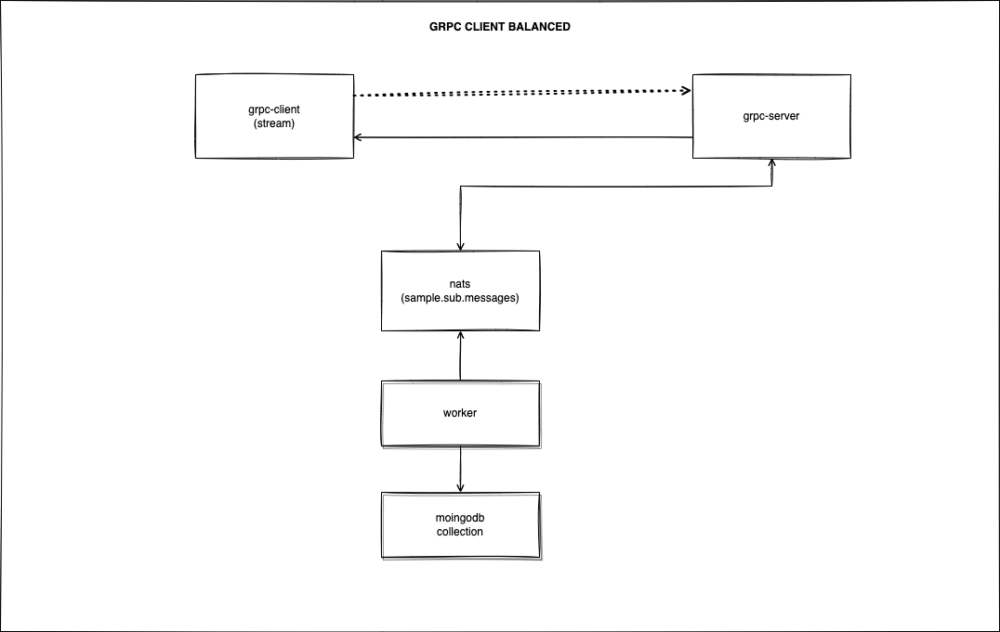

# grpc-sample

### High performance distributed architecture to ingest massive amounts of data using GRPC, Nats and Mongodb

## J4F

The J4F (Just for fun) projects are elaborate to demonstrate concepts, show benchmarks, and provoke doubts about well-established certainties

<!-- ## Challenges

TODO

## Architecture

TODO

## Environment

TODO

## Results

TODO -->
